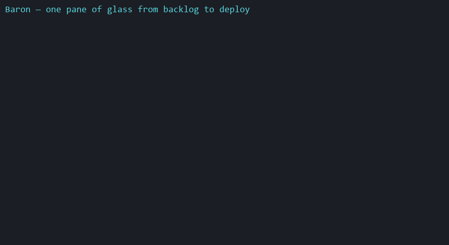

# Baron

> **One pane of glass from backlog to deploy — for AI coding agents.**
> Drive issues, branches, PRs, CI, deployments, and notifications across any stack through a single
> normalized contract, instead of hardwiring one vendor's API into your prompts.



## The problem

AI coding agents bake **one vendor's API** and **one team's process** into prompts. The moment your
issues live in Azure DevOps but your code is on GitHub, or your board columns aren't literally "To Do
/ Done", or you switch trackers next quarter — the prompts break, and the agent falls back to raw,
vendor-specific tools. You've hardcoded vendor lock-in into the way you work.

## What Baron does

Baron puts a **normalized contract** between the agent and your providers. The agent speaks one
abstract vocabulary — work items, branches, PRs, CI runs, deployments, notifications, in terms of
**roles** (`backlog → ready → in_progress → in_review → done`, plus `blocked`) — and Baron translates
to each provider's real API, states, and quirks. Mix providers freely (Linear issues + GitHub PRs +
Slack notifications). **Same prompt, any stack.**

## What it looks like

```
You:  Start a task: add rate limiting to the login endpoint.

Baron  ▸ runs the task-start recipe as ONE deterministic call:
  ✓ Created STORE-142 "Add rate limiting to the login endpoint"  (type role: task)
  ✓ Branched feature/STORE-142 from the repo's default branch
  ✓ Moved STORE-142 → in_progress
  ✓ Commented: "Started on branch feature/STORE-142."
```

That same prompt on **Azure DevOps** sets the work item state to `Active`; on **GitHub** it applies an
`in-progress` label — because `in_progress` is a *role*, not a vendor state. You confirmed that mapping
once, at `baron init`. The agent never learns a vendor's column names, and the workflow's order is
enforced by Baron's engine, not by the model improvising.

## Why it's different

- **Capability ports, not "a tracker."** `issues` / `scm` / `ci` / `deploy` / `notify`, each bound to
  a provider independently — so a consumer mixes providers rather than betting on one vendor spanning
  everything.
- **Normalize, don't raw-proxy.** New capabilities become first-class normalized ports; a clearly
  labeled provider-native escape hatch is the explicit last resort, never the default path.
- **Capability gaps are never silent.** When a provider lacks something (say, native issue hierarchy),
  Baron either emulates it (e.g. labels), degrades with a warning, or errors loudly — decided by
  policy, never swallowed.
- **Workflows are deterministic recipes.** Multi-step flows (`task-start`, `task-finish`, `ship`) are
  declarative YAML run as one rule-enforced call — the engine enforces step order, the agent doesn't.

## Quick start

Published to npm — no clone, no build. From inside your project:

```bash
# 1. Configure — one command. Auto-detects owner/repo from your git remote, prompts for the token
#    (hidden), writes .baron/credentials (gitignored) + .baron/policy.json (issues + scm bound).
npx -y @lonca/baron-cli@latest init --provider github      # or: --provider azure-devops

# 2. Check the policy against the live provider (drift → exit 1)
npx -y @lonca/baron-cli@latest doctor

# 3. Run a workflow recipe
npx -y @lonca/baron-cli@latest run --recipe <path-to>/task-start.yaml
```

Or drive it from an agent — install the Claude Code plugin (MCP server + workflow skills in one):

```
/plugin marketplace add loncadev/baron
/plugin install baron@baron
```

See [Getting started](./docs/getting-started.md) for the full walkthrough. Contributing to Baron
itself? Run from source with `pnpm baron …` — see [CONTRIBUTING](./CONTRIBUTING.md).

Or wire the **MCP server** into your agent and call the tools directly across every port —
`baron_issue_create`, `baron_scm_pr_create`, `baron_ci_runs`, `baron_deploy_deployments`,
`baron_notify_send`, plus `baron_recipe_run` for whole workflows. In Claude Code, the plugin also
ships per-recipe **skills** (`/baron:task-start`, `/baron:ship`). See [docs/mcp.md](./docs/mcp.md).

New to it? The [Azure DevOps setup walkthrough](./docs/setup-azure-devops.md) is copy-paste from
scratch (PAT scopes, `init → doctor → MCP`, troubleshooting).

## Providers

| Provider | Ports |
| --- | --- |
| **Azure DevOps** | `issues` · `scm` · `ci` · `deploy` |
| **GitHub** | `issues` · `scm` · `ci` · `deploy` |
| **Slack** | `notify` |

More adapters (Jira, Linear, GitLab, Notion) are on the roadmap — the whole point is that adding one
never changes how the agent talks to Baron.

## Documentation

| Guide | What it covers |
| --- | --- |
| [Getting started](./docs/getting-started.md) | Install, prerequisites, first `init` → `doctor` → `run`. |
| [Setup walkthrough — Azure DevOps](./docs/setup-azure-devops.md) | From-scratch, copy-paste setup on Azure DevOps + Claude Code. |
| [Concepts](./docs/concepts.md) | Ports, roles, capability gaps, the knowledge loop — the mental model. |
| [Configuration](./docs/configuration.md) | `.baron/policy.json`, role/type/gap maps, credentials. |
| [CLI](./docs/cli.md) | `baron init` / `doctor` / `run` reference. |
| [Recipes](./docs/recipes.md) | Writing YAML recipes: `ask` / `do` / `message`, interpolation, the op table. |
| [MCP server & plugin](./docs/mcp.md) | The MCP tools and the Claude Code plugin. |
| [Trying it with Claude Code](./docs/trying-with-claude-code.md) | Hands-on: wire the MCP server to a real project + a verification checklist. |
| [Providers](./docs/providers.md) | Which provider supports which port and capability. |
| [Demo script](./docs/demo.md) | Ready-to-record 60-second "single pane" demo (Claude Code or CLI). |

The full design decision record is in [ARCHITECTURE.md](./ARCHITECTURE.md); the contributor working
contract is [CLAUDE.md](./CLAUDE.md), contribution terms are in [CONTRIBUTING.md](./CONTRIBUTING.md),
and the publish playbook is [RELEASING.md](./RELEASING.md).

## Status

v1 is built end-to-end: the `issues`, `scm`, `ci`, and `deploy` ports across **Azure DevOps** and
**GitHub** plus `notify` via **Slack**, the config engine (`baron init` / `doctor`), a multi-port MCP
server, the YAML recipe engine + `baron run`, the knowledge loop, and a Claude Code plugin. Every
adapter passes a network-free **conformance suite**; the Azure DevOps ports are additionally
**live-validated** against a real project. GitHub/Slack live validation is next.

## License

Open-core. The core, the P0 adapters (Azure DevOps, GitHub, Slack), the recipes, and the CLI/MCP
server are licensed under [Apache-2.0](./LICENSE). Future commercial-tier features (SSO, secret-manager
integrations, multi-team governance, audit) will ship under a separate commercial license — see
[ARCHITECTURE.md](./ARCHITECTURE.md) decision #20.
