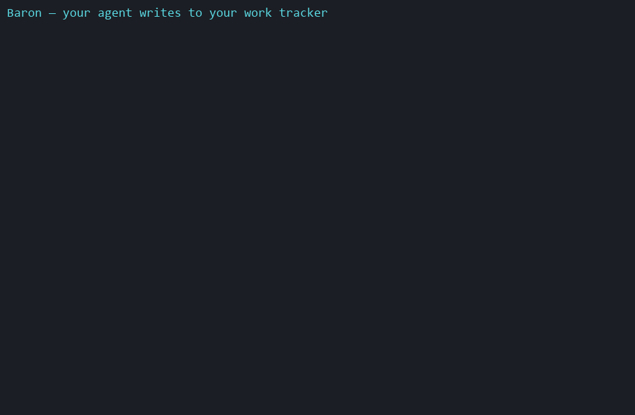

# Baron

> **Let your coding agent write to your work tracker — and keep the same flow when you change trackers.**
> Baron is an open-source layer that turns issues, branches, PRs, CI runs, and deployments into one
> normalized contract, so your agent never learns a vendor's API, states, or column names.



## The problem

AI coding agents bake **one vendor's API** and **one team's process** into prompts. The moment your
issues live in Azure DevOps but your code is on GitHub, or your board columns aren't literally "To Do
/ Done", or you switch trackers next quarter — the prompts break, and the agent falls back to raw,
vendor-specific tools. You've hardcoded vendor lock-in into the way you work.

## What Baron does

Plenty of tools let an agent *read* your tracker. Baron is about the other direction: **writing** —
creating work items, moving them, cutting branches, opening and merging PRs — which is where an agent
does damage when it guesses a vendor's state machine wrong.

The agent speaks one abstract vocabulary in terms of **roles** (`backlog → ready → in_progress →
in_review → done`; blocking is an orthogonal flag, so a blocked item keeps the role the work is
actually in), and Baron translates to each provider's real API, states, and
quirks. You confirm that mapping once, at `baron init`, and it is committed to your repo as
configuration — not re-guessed by the model on every call.

Each port binds to a provider independently, so `issues` on Azure DevOps, `scm` on GitHub, and
`notify` on Slack is a normal setup rather than a special case.

## What it looks like

```
You:  Start work on STORE-142.

Baron  ▸ runs the task-start recipe as a single call:
  ✓ Loaded STORE-142 "Add rate limiting to the login endpoint"  (type role: task)
  ✓ Checked it: not done, has a canonical branch, not assigned to someone else
  ✓ Branched feature/STORE-142 from the repo's default branch
  ✓ Moved STORE-142 → in_progress, assigned to you
  ✓ Commented on the item: "Started work — on branch feature/STORE-142."
```

That same prompt on **Azure DevOps** sets the work item state to `Active`; on **GitHub** it applies an
`in-progress` label — because `in_progress` is a *role*, not a vendor state.

The checks matter as much as the actions: if the item is already done, belongs to someone else, or is
a container that should never be branched, the run stops **before** anything is created. The branch
name is derived by Baron from the item's type role, so every agent and every recipe derives the same
name for the same item instead of inventing one.

## Why it's different

- **Capability ports, not "a tracker."** `issues` / `scm` / `ci` / `deploy` / `notify`, each bound to
  a provider independently — so a consumer mixes providers rather than betting on one vendor spanning
  everything.
- **Normalize, don't raw-proxy.** New capabilities become first-class normalized ports; a clearly
  labeled provider-native escape hatch is the explicit last resort, never the default path.
- **Capability gaps are never silent.** When a provider lacks something (say, native issue hierarchy),
  Baron either emulates it (e.g. labels), degrades with a warning, or errors loudly — decided by
  policy, never swallowed.
- **Workflows are recipes, not prompts.** Multi-step flows (`task-start`, `task-finish`, `task-land`,
  `ship`) are declarative YAML executed as a single call, with guards that stop a run *before* it
  mutates anything. The order lives in the recipe rather than being improvised per run.

The first of those is the one worth reading about rather than being told:
**[You can't set a status in Jira](https://dev.to/keparlak/you-cant-set-a-status-in-jira-4d7p)**
walks through why a work tracker cannot be normalized by mapping four states onto everything — Jira
refuses to set a status at all and makes you discover the permitted transitions first, Linear's
workflow states belong to a team rather than the workspace, GitHub has no hierarchy to map. It is
the argument this design answers.

## Quick start

Published to npm — no clone, no build. From inside your project:

```bash
# 1. Configure — one command. Auto-detects owner/repo from your git remote, offers to sign you in
#    through your browser (or paste a token instead), writes .baron/credentials (gitignored) +
#    .baron/policy.json (issues + scm bound).
npx -y @lonca/baron-cli@latest init --provider github      # or: --provider azure-devops

# 2. Check the policy against the live provider (drift → exit 1)
npx -y @lonca/baron-cli@latest doctor

# 3. Run a workflow recipe
npx -y @lonca/baron-cli@latest run --recipe task-start          # by name; or pass a path
```

On GitHub, step 1 opens the approval page and you confirm a short code — no permission list to read,
no boxes to tick, no token to paste. Pasting a fine-grained token is still offered, because it is a
narrower credential than any OAuth scope and an install that wants the tighter one should not have to
fight the friendlier path to get it. Either way `baron doctor` verifies what the credential can
actually do before you start work.

Or drive it from an agent — install the Claude Code plugin (MCP server + workflow skills in one):

```
/plugin marketplace add loncadev/baron
/plugin install baron@baron
```

See [Getting started](./docs/getting-started.md) for the full walkthrough. Contributing to Baron
itself? Run from source with `pnpm baron …` — see [CONTRIBUTING](./CONTRIBUTING.md).

Or wire the **MCP server** into your agent and call the tools directly across every port —
`baron_issue_write op=create`, `baron_scm_write op=pr_create`, `baron_ci_read op=runs`, `baron_deploy_read op=deployments`,
`baron_notify_send`, plus `baron_recipe_run` for whole workflows. In Claude Code, the plugin also
ships per-recipe **skills** (`/baron:task-start`, `/baron:ship`). See [docs/mcp.md](./docs/mcp.md).

The server is listed in the official **MCP Registry** as `io.github.loncadev/baron`, and runs as a
container for anyone who would rather not have Node on the host — see
[docs/mcp.md](./docs/mcp.md#running-it-as-a-container).

New to it? The [Azure DevOps setup walkthrough](./docs/setup-azure-devops.md) is copy-paste from
scratch (PAT scopes, `init → doctor → MCP`, troubleshooting).

## Providers

| Provider | Ports |
| --- | --- |
| **Azure DevOps** | `issues` · `scm` · `ci` · `deploy` |
| **GitHub** | `issues` · `scm` · `ci` · `deploy` |
| **Linear** | `issues` |
| **Slack** | `notify` |

GitLab and Jira are on the [roadmap](./ROADMAP.md) — adding one never changes how the agent
talks to Baron, which is the whole point. Until they land, those names describe intent, not support.

## Documentation

| Guide | What it covers |
| --- | --- |
| [Getting started](./docs/getting-started.md) | Install, prerequisites, first `init` → `doctor` → `run`. |
| [Setup walkthrough — Azure DevOps](./docs/setup-azure-devops.md) | From-scratch, copy-paste setup on Azure DevOps + Claude Code. |
| [Concepts](./docs/concepts.md) | Ports, roles, capability gaps, the knowledge loop — the mental model. |
| [Configuration](./docs/configuration.md) | `.baron/policy.json`, role/type/gap maps, credentials. |
| [CLI](./docs/cli.md) | `baron init` / `doctor` / `run` reference. |
| [Recipes](./docs/recipes.md) | Writing YAML recipes: `ask` / `do` / `message`, interpolation, the op table. |
| [MCP server & plugin](./docs/mcp.md) | The MCP tools and the Claude Code plugin. |
| [Trying it with Claude Code](./docs/trying-with-claude-code.md) | Hands-on: wire the MCP server to a real project + a verification checklist. |
| [Providers](./docs/providers.md) | Which provider supports which port and capability. |
| [Demo script](./docs/demo.md) | Ready-to-record 60-second demo (Claude Code or CLI). |

The full design decision record is in [ARCHITECTURE.md](./ARCHITECTURE.md); the contributor working
contract is [CLAUDE.md](./CLAUDE.md), contribution terms are in [CONTRIBUTING.md](./CONTRIBUTING.md),
and the publish playbook is [RELEASING.md](./RELEASING.md).

## Status

v1 is built end-to-end: the `issues`, `scm`, `ci`, and `deploy` ports across **Azure DevOps** and
**GitHub** plus `notify` via **Slack**, the config engine (`baron init` / `doctor`), a multi-port MCP
server, the YAML recipe engine + `baron run`, the knowledge loop, and a Claude Code plugin. Every
adapter passes a network-free **conformance suite**; the Azure DevOps ports are additionally
**live-validated** against a real project.

Baron now also runs this repository — its issues, branches, and pull requests move through its own
GitHub adapter. That is a working proof, not adoption: Baron is young and has not yet been put
through a stack it did not grow up on. If you run it against yours, the resulting bug report is the
most useful thing you could send. What is planned next, and what is deliberately out of scope, is in
[ROADMAP.md](./ROADMAP.md).

## License

Open-core. The core, the adapters (Azure DevOps, GitHub, Linear, Slack), the recipes, and the CLI/MCP
server are licensed under [Apache-2.0](./LICENSE). Future commercial-tier features (SSO, secret-manager
integrations, multi-team governance, audit) will ship under a separate commercial license — see
[ARCHITECTURE.md](./ARCHITECTURE.md) decision #20.
